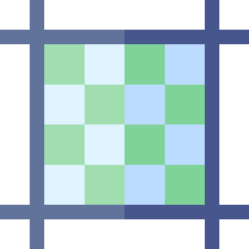

 

<h1 align="center">PIXEL BOX</h1>

Draw, export and import in your pixel box

<a href="https://cheng-dx.github.io/pixel-box">📦 Online Playground</a>

 

## Features

- Choose the box size you like
- Pick color
- Draw
- Export a .json file
- Import other's file to edit

## Examples

**_Thanks to my friend_**
 

妙蛙种子 | フシギダネ | Bulbasaur

妙蛙草 | フシギソウ | Ivysaur

## License

[MIT](./LICENSE) License © 2022 [Cheng-DX](https://github.com/Cheng-DX)
